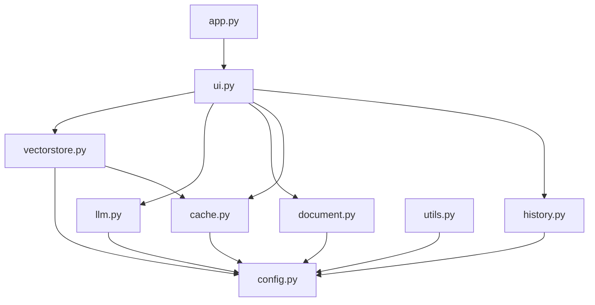

# rag_core – Modular RAG Engine

This package contains all core logic for the PITB RAG Chatbot.

## Modules

- **ui.py** – Streamlit UI, chat, sidebar, and state management
- **vectorstore.py** – ChromaDB vector storage, retrieval, and reset logic
- **llm.py** – LLM streaming, prompt construction, and retry logic
- **document.py** – PDF/DOCX loading, chunking, and metadata
- **cache.py** – Embedding and file hash caching utilities
- **history.py** – Persistent chat and context storage (per chat)
- **config.py** – Environment variable and logging setup
- **utils.py** – Miscellaneous helpers

## Module Dependency Diagram

## Key Design Patterns

- All vector operations are batched and retried for robustness.
- Embeddings are cached by file hash to avoid recomputation.
- All chat and context history is saved per chat and globally.
- UI state is managed via `st.session_state` for reliability.

## Extending

- **Add new file types:** Extend `DocumentProcessor` in `document.py`.
- **Add new vector backends:** Implement a new `VectorStore` in `vectorstore.py`.
- **Add new LLMs:** Update `llm.py` with new API logic.

## Developer Notes

- All modules are type-annotated and use robust error handling.
- Logging is centralized via `config.py`.
- For advanced usage, see the top-level `GUIDE.md`. 